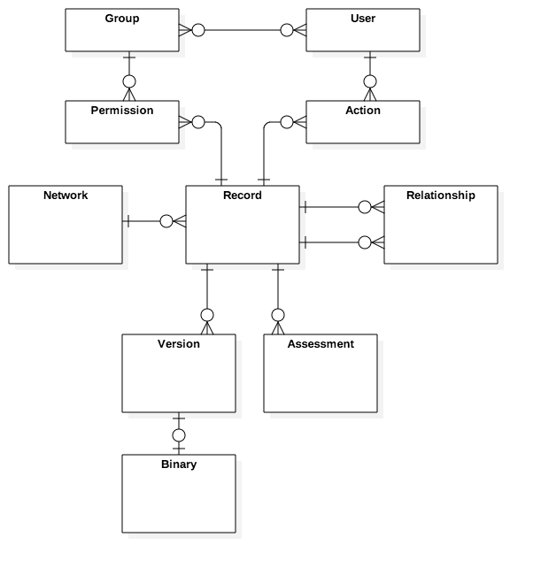

# Logical Data Model

## REST Resources

Based on the conceptual entity-relationship model shown below, the REST resources will be something like

* records
* records/{id}/versions
* relationships
* organisations
* users
* users/{id}/actions

Note that the "network" entity will map to a REST base path (ie URL domain) not so much to a resource.  



## REST Methods

The generic RESTful method call will be something like

{http VERB} https://{service}.api.{network}/{version}/{resource}/{id}/{sub-resource}?property=value&property=value

Base path example could be

https://sharing.api.digitalrecords.gov.au/v1

Some examples (excluding base path)

* GET /records?owner=austrac.gov.au&keyword=motorcycle would return a collection of records (just summary metadata) for all records owned by austrac with the keyword "motorcycle"
* GET /records/{austrac.gov.au:1293847563} would return the full details of a specific record including the latest version and a list of links to earlier versions.
* GET /records/{{austrac.gov.au:1293847563}/versions/{12} would return the 12th version of the record only.
* GET /relationships?record.identifier=austrac.gov.au:1293847563 would return a collection of records (just summary metadata) that are related to to the given record.

and so on - you get the picture.

## Record Resource

In accordance with [AGrkms metadata set](http://www.naa.gov.au/information-management/digital-transition-and-digital-continuity/information-is-interoperable/metadata/ref-tables.aspx) - and in gory detail, the [agrkms v2.2 (2015) specification](http://www.naa.gov.au/Images/AGRkMS-Version-2.2-June-2015_tcm16-93990.pdf) 

```
{
  "Record":{
    "Identifier":"austrac.gov.au:1293847563",
    "Version":"current",
    "Owner":"austrac.gov.au",
    "DateCreated":"2017-03-18T12:12:00",
    "DateUpdated":"2017-05-22T09:34:00",
    "Classification":"UNCLASSIFIED",
    "DLM":"Sensitive:Personal",
    "Type":"document",
    "Title":"OMG Transactions 2016",
    "Author":"Bob Smith",
    "Description":"Some cool clickbait here",
    "MIMEType":"application/msword",
    "Size":"249844",
    "Language":"EN",
    "Rights":"Not For Release",
    "RecordsAuthority":"GDA21",
    "DisposalAction":"Retain permanently",
    "Keywords":[
      "motorcycle",
      "money laundering",
      "financial"
    ],
    "Hash":"12209cbc07c3f991725836a3aa2a581ca2029198aa420b9d99bc0e131d9f3e2cbe47",
    "Location":"https://lifecycle.api.digitalrecords.gov.au/v1/records/austrac.gov.au:1293847563",
    "versions":[
      {
        "version":"2",
        "tag":"final draft",
        "Date":"2017-05-09T02:42:00",
        "Hash":"569be5f10d248e62dd1c8c82d0e3a19e37452f4280b685d35d158",
        "Location":"https://lifecycle.api.digitalrecords.gov.au/v1/records/austrac.gov.au:1293847563/versions/2"
      },
      {
        "version":"1",
        "tag":"first draft",
        "Date":"2017-03-18T12:12:00",
        "Hash":"569be5f10d248e62288438e77d83900a0c00b985d3973bb4",
        "Location":"https://lifecycle.api.digitalrecords.gov.au/v1/records/austrac.gov.au:1293847563/versions/1"
      }
    ]
  }
}
  ```

## Relationship Resource

```
{
"Relationship":{
   "Type":"ShareContext",
   "CreatedDate":"2017-03-18T12:12:00",
   "FromRecordID":""austrac.gov.au:1293847563",
   "ToRecordID":"afp.gov.au:RR234/293484",
   "createdBy":"bill.bailey@afp.gov.au"
   }
}
```

## Usage in the search & sharing protocol

A search request would return a records collection each with a minimal set of metadata like:

```
{
  "Record":{
    "Identifier":"austrac.gov.au:1293847563",
    "Owner":"austrac.gov.au",
    "DateUpdated":"2017-05-22T09:34:00",
    "Type":"document",
    "Title":"OMG Transactions 2016",
    "Description":"Some cool clickbait here",
    "Hash":"12209cbc07c3f991725836a3aa2a581ca2029198aa420b9d99bc0e131d9f3e2cbe47",
    "Location":"https://lifecycle.api.digitalrecords.gov.au/v1/records/austrac.gov.au:1293847563"
  }
}
  ```
  
  That could be returned in a collection from a search query like
  
  `GET /records?owner=austrac.gov.au&keyword=motorcycle`
  
  When the user clicks on the links, he'she is essentailly doing a GET on the specific record like this
  
  `GET https://lifecycle.api.digitalrecords.gov.au/v1/records/austrac.gov.au:1293847563`
  
  Lets assume that the provider agency has some rules that specific mnimum request parameters that are needed provider the actual record.  So this request doesnt get the actual record but instead gets a list of required parameters like
  
  ```
{
  "Conditions":[
    "userID",
    "recordID"
  ]
}
```

  That is essentially saying "I'll give you the record but you ahve to tell me your recordID and your userID".  This drives the interstitial pop-up form.  The requesting user (manually or via integration with the local information system), preovides the data and sends a new GET request of the form:
  
`GET https://lifecycle.api.digitalrecords.gov.au/v1/records/austrac.gov.au:1293847563?userID=bill.bailey@afp.gov.au&recordID=afp.gov.au:RR234/293484`
   
This GET request now meets the conditions of the provider and so the full record resurce is provided 
