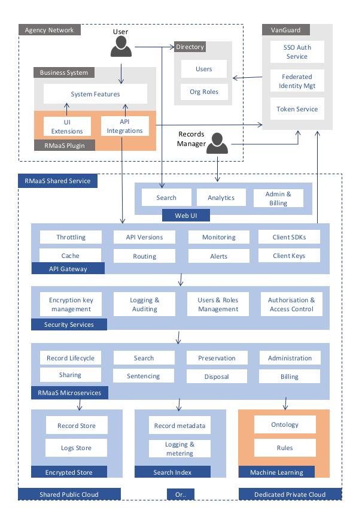

# System Context Model

## Agency – Business System

This is any source of unstructured or structured data that may be a record of government activity.  

Unstructured data sources may include:

* Network fileshare drives
* Email tools like Outlook or GoogleMail
* Filesharing services like dropbox or one drive
* Collaboration tools like Sharepoint or Google Docs
* Social platforms like facebook or twitter
* Web content tools like Drupal or Wordpress 
* Messaging tools like Skype or Slack
* Distributed file systems like Github
* Domain specific workflow systems like case management systems

Structured data sources may include:

* Finance/ERP systems like SAP or TechnologyOne
* CRM Platforms like Seibel or Salesforce
* Agency Line of business systems like DIBP visa processing or ATO tax collection systems.

File types from these systems may include

* Simple text such as email or text messaging
* Application documents like word, excel, pdf, etc
* Structured data formats such as XML or JSON
* Multimedia data such as audio, photo, or video files.

All these data types from all these systems are government records if used for the purpose of official business by a government employee or contractor.  

## Agency – RmaaS Plugin

This is the “glue” between the agency business system and the RMaaS Microservices.  It is responsible to capture data at appropriate points in the lifecycle of user interactions with the business system and push it to the RMaaS API.  For example

* Send (outbound) or open (inbound) action on an email inbox.
* Save action on a file in MS Word.
* Every tweet from a government account.
* Each publish from a web CMS
* Every state change in the lifecycle of a government business process (eg Visa application lifecycle)

The RMaaS plugin is responsible for 

* Identifying the user (via SSO token with VANguard) and providing that token to RMaaS so that the responsible user (and org membership) is attached to the record.
* Including application specific metadata together with the record object so that the maximum available structured metadata is included (this will depend on the application).
* Maintaining unique identifiers for files that may be versioned (even with different names) so that RMaaS knows whether file is new or a version of an existing one.
* Optionally, adding a UI for other RMaaS microservices such as Search and Share.

There is expected to be a rich marketplace of plugin providers.  There are three possible delivery models

* Support for the RMaaS API is natively included by the application vendor.  This is an unlikely short term model but very plausible if the Open Source RMaaS platform is widely by other national and international jusrisdictions.
* Specialist vendors that already provide records management plugins (eg Kapish, i-Cognition, CastlePoint, etc) will provide similar plugins for the integration of COTS products with RMaaS.  This is the most likely scenario when the business system is a COTS product..
* The user agency custom builds plugins between their business systems and RMaaS.  This is the most likely scenario when the business system is a bespoke / unique agency line of business system.

## Agency – Directory

This is the Agency user directory that is the source of truth for user identity and authentication.  Typically a Microsoft Active Directory Server.  This system must;

* Integrate with the VANguard federated identity service.  In most cases, the agency directory will already be integrated with VANguard because earlier projects such as PWS will have triggered that work.  
* Provide sufficient minimal user identity and role information including first name, last name and email.  Ideally including further identity information such as APS ID and organizational unit membership and job role.  

## VANguard – SSO Authentication

The Single Sign On authentication service from VANguard provides users with a SAML2 based authentication to external cloud services that provide a web user interface.  This service exists already and is integrated with most agency directories because it is used for PWS (parliamentary Workflow Service) integration and several other cloud services.  

This service is used for the Web UI components of the RMaaS service which are for search, analytics, admin, and billing.   The authentication workflow and user experience are decribed at http://www.vanguard.business.gov.au/ourservices/Pages/Federated-Authentication-Service-(FAS).aspx 

## VANguard – Federated Identity

This is a foundation capability that underpins both the UI based SSO service and the API based token service.  VANguard in integrated with each participating agency active directory service and provides a single ADFS end point to cloud services.  The capability already exists at VANguard but may need some extension to support RMaaS including

* Extra user meta-data to reflect organizational membership and roles.
* An identity mapping capability that can link multiple agency specific identities together to represent the same physical person (for example bob.smith@ssc.gov.au is the same as bob.smith@finance.gov.au because bob either switched jobs or was MOGged).

## VANguard Token Service

This is a new service that VANguard must build for RMaaS but it will leverage the existing AD integration and federated identity capability.  This service is similar to the SSO service for human access to cloud web UI services, except that in this case the client is not the user but the RMaaS plugin.  It is a machine to machine API integration equivalent of the SAML2 based user authentication service.

This service will use the OAuth2.0 protocol and will provide JWT (Java Web Token) that the RMaaS plugin can use to authenticate agency users to the RMaaS using the “authorization code grant flow” at http://www.bubblecode.net/en/2016/01/22/understanding-oauth2/ 

* The “resource owner” – which is the Agency user.
* The “resource server” – which is the RMaaS API.
* The “Authorisation Server”– which is VANGuard.
* The “client” – which is the Agency RMaaS plugin.

In the RMaaS case some changes to the default flow may be appropriate

* The user consent step may be skipped if the client (RMaaS plugin) is trusted.
* There may be value in an additional call from RMaaS API to get extra information about the user that is not carried in the JWT.

## RMaaS – API Gateway

The API gateway is an important technology layer that is positioned between the calling client (the RMaaS plugin in an Agency business application) and the actual RMaaS business services.  The key functions of the API gateway layer are:

* Throttling – some RMaaS services are compute intensive and, whether by accident (eg a badly programmed client repeating requests in a loop) or by malicious intent (eg a denial of service attack), it is important to impose throttling rules that can block one excessive source of requests whilst maintaining service levels to others.
* Caching – some requests might be expensive to process but commonly issued (eg frequently repeated searched) and performance is boosted by responding with a cached copy rather than re-running the service.  
* Monitoring – analytics on API usage by application / agency are provided by the monitoring / metering service and can use used for analytics and billing.
* Alerting – when certain defines thresholds are crossed (eg excessively slow responses or excessively high volume requests) then alerts can be sent to resolver groups to act on the warnings.
* Versioning – multiple versions of each API must be supported for sufficient time periods for different clients to transition.  Typically the current version and two previous versions, giving client applications at least a year to upgrade.
* Routing – based on path or content, routing API service requests to the appropriate internal RMaaS Service.
* Client SDKs – Generating software development kits in different languages (java, .NET, python, node, etc) to simplify implementation for RMaaS plugin developers.
* Client Keys – provide a way to restrict access to registered client applications (eg the ACME plugin for Sharepoint).  Note that this is NOT the same as the ultimate agency user authentication because it is authenticating the Plugin as a valid client system, not the agency user as a valid owner of a record.

## RmaaS – Security Services

The security layer between the API gateway and the actual RMaaS business services is responsible for enforcing compliance with the ASD ISM so that RMaaS will successfully pass an I-RAP assessment to PROTECTED level.

* The key management service is used to securely manage the issuing and rotation of encryption keys that are used to encrypt record in storage.  There will normally be at least one encryption key per customer agency (larger agencies may manage keys at a more granular level to reflect confidentiality boundaries between major organisation units).  Note that this is not the same as the API client keys (that authenticate a registered plugin) or the user JWT (that authenticates a specific agency user).  The encryption keys provide “security in depth” for cloud hosted systems by encrypting record content in storage.  Therefore, even if the storage server is compromised by an unauthorised attacker, there will be nothing to find but encrypted “gook”.  
* The logging and auditing service records a log of every user action (both normal agency users and privileged users such as records managers and system administrators).  This is distinct from the API gateway logging which just counts API requests.  This service will record (for example) that bob.smith@finance.gov.au modified the record with ID=”123456789” on 2017-06-31T13:01:15.  The logs will be immutable and auditable by suitably authorised users.  This is a key ISM control.
* User & Role management provides a view of all users in the system and their permissions over records / domains and a history of all actions.  Although users are created dynamically based on VANguard tokens (so there is no need for agency users to register in advance), there is still a local user database because there is a need to link users to an auditable history of actions and to be able to specify some access permissions at RMaaS level (eg the sharing API).
* Access control is the layer that ensures that identified users can only perform the actions that they are allowed to perform.  In general, any VANguard authenticated user can POST new records or new versions of existing records.  A user can also GET any record they created.  GET on records not created by the requesting user would be controlled by rules related to the user’s job position and agency / organisation unit membership.  Privileged actions like DELETE for disposal functions would be limited to a very few authorised role (eg agency records managers).  

## RMaaS Microservices – Record Lifecycle API

This is the core service for registering new or updated records.  The service behaviour is broken into a synchronous part (to give a real time response to the user) and an asynchronous part (allowing for longer running advanced processing without keeping the user waiting).

Creating a new record is achieved via a call of the form POST /records (file object, metadata, user info).  The synchronous processing will

* Check user authorization (and return an error if unauthorised)
* Check minimum metadata compliance (and error if not compliant)
* Check the file attachment for file type and max size (see note 1) compliance (and error if not compliant)
* Return a globally unique ID for the record, which the client can use for future actions on the record.

Adding a new version to an existing record is achieved via a call of the form POST /records/{ID}/versions (modified file object, metadata, user info).  The synchronous processing will

* Perform the same checks as a new record (returning errors as appropriate)
* Check that a record with the specified ID exists (returning an error is not matched)
* Return the currently available enriched metadata about the record.
* This will normally be completed in much less than one second.

The asynchronous processing in either case (new or updated) will

* Complete a virus scan
* Encrypt and store the file object in the archive service, identified by it’s IPFS hash.  Note that this step will automatically de-duplicate across government because identical files will have the same IPFS hash and so the archive service will store only one copy. See note 3.
* Convert the binary file (eg a word document) to a clean text equivalent.
* Perform an automated keyword extraction – using the national and agency specific ontology to facilitate keyword identification and ranking.
* Apply sharing permissions to the record according to agency default rules (possibly with override by the publishing client). See note 4.
* Index all metadata (client supplied system metadata, keyword extraction metadata, user metadata) in the search index.
* Apply initial machine learning algorithm to identify the sentencing and disposal rules for the record (see note 2)
* This will normally be completed within at most one minute.  Therefore clients may choose to poll for results each minute until completed.  

The lifecycle API will also support retrieval of user records via a GET /records?(parameters) to get a list of records or GET /records/{ID} to get details of a specific record.

* The GET /records collection request will be serviced by the search API described in the next section.
* The GET /records/{ID} will return all metadata about a specific record including the full version history and (optionally) the latest version of the record object.
* The GET /records/{ID}/versions/{number} will return a specific historical version of the record.
* In all cases, the GET requests return enriched metadata after keyword extraction and will include the latest sentencing decisions and linked data discoveries (see note 5).

### Notes

1. The system will handle files of any arbitrary size (even multi Gb or Tb movies or big data sets).  However files above a certain size limit must be stored separately in the archive service (which returns an IPFS hash) and then only the IPFS hash is sent to the /records lifecycle API.
2. Advanced machine learning and other algorithmic services are background tasks that will run continuously over larger record sets, potentially further enriching metadata (eg by identifying links with other records) and changing sentencing decisions (as rules improve).  Therefore information about the records may be enriched over time (but not the record itself of course).  
3. In some cases, the client may choose not to store the record itself in the RMaaS archive.  In such cases, the RMaaS will perform all asynchronous steps including keyword extraction and search indexing but will not store the record.  Instead it will maintain a pointer to the agency network location of the record.  
4. Access permissions for records are typically governed by agency configuration.  A typical default may be that record metadata is visible to any authorised government user but the record itself is visible only to a user in the agency that published the record.   More restrictive policies (ie for sensitive data) or less restrictive policies (ie for public data) may be applied on a case by case basis.
5. Machine learning for sentencing decisions is only one kind of algorithm that maybe be available in a potential marketplace of machine learning services (“algo-market”).  A linked data analysis engine may operate over large data sets and identify potential related records.  The results of the linked data analysis would be added to record metadata, potentially allowing users to discover related work “here’s some other records you may be interested in..”.  Clicking on those linked records would reveal other related records and facilitate a “linked data explorer” capability.

## RMaaS Microservices – Record Search API

The record search API will work over the entire holdings that a given user is allowed to see (see note 1 & 2).   A service request of the form GET /records?(query parameters) will

* Submit the query to the RMaaS search index
* Return a paginated list of matches (eg “here’s the first 50 of about 15,350 matches”) sorted by relevance (unless the query parameters request an alternative sort order)
* Include facet counts of indexed fields (eg count of hits by agency, year, type, etc).
* Return results within 5 seconds irrespective of the index size, even if the search is across the entire government holdings. See notes 3 & 4.
* Expect the user to either submit a new query (eg with more restricted criteria) or ask for another page in the list.
* When the user requests a specific record, the request is serviced by the lifecycle API as described in the previous section.

Query parameters and facet counts are key to a high quality search experience,

* Query results can be filtered by any indexed field (both standard and extended /enriched metadata) – for example by agency, by date range, by record type or status, by publisher, by subject area, by file type or size, and so on.
* An “explore” approach to search is also facilitated by faceted counts – for example a search that returned 20,000 hits would also return counts of hits by each filter term (eg number of hits by agency, year, record type, subject area, etc).  User can click on a facet count to further restrict the search (eg “just show me results for records registered in 2007”)

The search API may also leverage linked data relationships (via SPARQL query) to return records that are related even though there is no explicit search index term match.  For example returning a list of records that are linked to or referenced by the current record

### Notes

1. The permissions to see record metadata may be different to the permissions to view the record.  For example, it may be possible for a user in the finance.gov.au domain to search over the entire government holdings but, when finding a reference to a specific record at ato.gov.au, may have to request (via the sharing API) permission to see the specific record.  
2. A user will never be allowed to see either the metadata or the record itself when the classification of the record is higher than the security clearance of the user. 
3. The search would be serviced by a big data search index service such as elasticsearch or AWS cloud search or Google enterprise search.  These services are designed for very high performance over very large data sets.  Additionally all search queries will be cashed for faster response times when the same query is requested within the cache timeout period.
4. Only record metadata is indexed (including the enriched metadata from keyword extraction) therefore, unlike full content indexes, the total index size will be much smaller (around 5%) than the total record storage volume.  This approach will support faster results at lower cost with no sacrifice in quality.

## RMaaS Microservices – Record Sharing API

The sharing API is critical to support collaboration and re-use of information within an agency, across agencies, across jurisdictions, and even with the general public (depending on visibility rules set by the publisher).  There are two basic use cases;

* A user that has rights to over a record may invite other users to view and/or update the record.  The invited users would receive an email with a link to the record and may then view and/or update according to granted permissions.
* A user that discovers the existence of a record via a search result (but does not have permissions to view the actual record) may send a request to the record owner to access the record. The record owner would receive an email request with a link to the record and would then allow or deny the request.

In both cases, the sharing API would enforce information sharing rules and may reject the sharing request.  

* If the information classification is above the clearance of the user with whom the record would be shared.  Unless the user profile indicates otherwise, all users authenticated via an agency directory are assumed to have baseline clearance.
* If the invited user is outside the visibility scope of the record as defined by the agency records manager or ITSM.  For example if a record policy says it must not be shared outside of the agency then it cannot be shared without a change in policy on that record.  

At the time a record is registered via the lifecycle API, the default sharing rules will be applied.  For each information classification (UNCLASS, DLM=xx, PROTECTED) and potentially by other category schemes (by org unit or subject area), the agency may 

* Define sharing scope (agency, government, public)
* Define rules (MUST NOT be shared, MAY be shared, SHOULD be shared).

## RMaaS Microservices - Sentencing API

The sentencing API applies machine learning algorithms to identify the appropriate records authority rule and corresponding sentencing decision.  The service is invoked via a call of the form GET /decisions/{ID} and will

* Get the record identified by {ID}  
* May re-apply keyword extraction 
* Submit the enriched metadata to the machine learning algorithm
* Optionally submit the same record ID to additional sentencing algorithms (see note 1)
* Return the decision result(s) to the calling system.

There are several possible triggers for calling the sentencing API

* As a standard part of the record registration or update process where the calling client is the lifecycle API.  The results of the decision are added to the record metadata.
* On demand by a user for any record owned by that user.
* In bulk by the records manager over some or all of the agency records holdings.  This is a privileged user API of the form PATCH /decisions?(query parameters) which will re-calculate and reapply decisions over all records matching the query.  

### Note

1. Machine learning is an evolving technology and, even with high quality algorithms, depends on the quality of the learning data sets and reference ontologies.  Therefore it is possible that different algorithms will deliver different results.  One way to mitigate risk of misclassification is to encourage the development of multiple providers of machine learning solutions (an “algo-market”) and to apply record metadata to multiple algorithms.  If two algorithms agree then the risk of wrong classification is reduced.  If they don’t agree then either submit to a third and accept a best of three or escalate for manual intervention.

## RMaaS Microservices - Disposal API (and UI)

Disposal is a less frequent function and will normally be performed only by an authorised role such as the agency records manager.  Therefore this feature will be available as both an API service and also as an Admin UI function.   The key concern with disposal is “did the machine get the sentencing decision right and is it safe to delete this record?”  Since most documents submitted to the lifecycle API will not be records of national interest that require long term preservation at NAA, the volume of disposal candidates will become very high after a few years of RMaaS operation (roughly equal to the volume of new record in any year in a steady state model).  Since there is no practical possibility to review each record manually and decide if it is safe to dispose, the RMaaS must provide the records manager with sufficient analytics data in order to manage by exception (ie to view statistics about bulk disposal candidates in order to help identify risk areas or exceptions that justify manual intervention).  The records manager will be able to

* GET /records that are disposal candidates and be able to analyse the data set by a number of dimensions to look for anomalies
* Submit any disposal candidates to the sentencing API to re-confirm records authority decisions ( ontologies or rules may have changed since the original sentencing decision)
* Submit disposal candidate to linked data algorithms that may identify connections to other records of national interest.
* Once confident of the disposal decision for a given group of records then perform the DELETE /records action for the group.
* Deleted record metadata will be retained but archived and will not be returned as part of normal search operations.

## RMaaS Microservices - Preservation API /UI

Older digital records that may have been created using software applications that are currently obsolete may prove difficult to read ( eg lotus 123 spreadsheets).  Therefore an important part of record keeping is to transform older file formats into representations that can be read with current software.  The records manager will be able to 

* Find records with file formats that are at risk of obsolescence.  
* Call the preservation API to transform those records into current / archival formats.
* Link the new format to the original record (which should not be destroyed unless it has reached it’s disposal date).

Preservation functions will be available as API services and also as admin UI functions.

## RMaaS Microservices - Billing API

A key principle in fee-for-service cost recovery models is to align the granularity of fees as much as possible with the granularity of costs.  As an open source system built on cloud IaaS and PaaS platforms, the cost structure will be very fine grained (eg per CPU second compute, per Gb month storage, per Gb transferred, per million API calls, etc).  The fee for service pricing can abstract these fees to some extent in order to provide a simpler pricing model to customer agencies but is still like to be based on counting a large number of small units.  One possible pricing metric is per record held per month and, if that metric is used, modelling indicated a price of less than 1 cent per record per month.  

It is clearly impractical to manually generate bills when the unit of charge is so small.  Therefore an essential part of the platform is the metering engine that will “count” the units of charge and the associated billing engine that will aggregate the counts, allocate to agencies, and generate invoices.  The billing API will

* Allow agencies to track their consumption on a day to day basis, avoiding surprises in monthly bills.
* Allow RMaaS system administrators to analyse both input costs and customer billing revenue in order to analyse and, if necessary, tune pricing.
* Push customer invoices to the hosting agency’s financial management system.

## RMaaS UI - System Administration

The RMaaS will provide an administration UI at system level and at agency level.  

System level admin functions will include

* System performance and capacity monitoring
* Verification and registration of new plugins
* Verification and registration of new algo providers
* Management of system level ontologies and rules
* Creation of agency level accounts and admin users
* Management of billing units and pricing
* System level audit log analysis
* Review and approval of new releases (ie code updates)

Agency level admin functions will include

* Management of agency level privileged accounts and roles
* Management of encryption keys including key rotation rules.
* Registration of agency applications (records sources)
* Management of agency level ontologies and rules
* Agency level audit log analysis
* Records analytics reporting
* Preservation and disposal functions
* NAA transfer functions

## RMaaS UI – Search 

Search is a core function of RMaaS and will add enormous value to APS users by facilitating discovery and re-use of information.  Search will be available as an API and as  UI to that plugin implementers can choose whether to consume the API (and render their own search UI) or whether to embed the RMaaS UI into their products.  

The search functions have already been described in the Search API section and will not be repeated here. 

## RMaaS UI – Analytics 

Analytics is related to search but has a different purpose.   The analytics user is looking for trends or anomalies in big data sets rather than searching through all holding to find a specific record.  The Analytics service will allow users and records managers to

* See time series trends – eg record volume by month by RA category.
* See organisational performance – eg record count by org unit or user by month.
* Category anomalies – eg machine decision subject areas by org unit (highlighting records with subject categories that do not match the org function)
* Information security anomalies – eg records with financial or payroll information not classified correctly.
* Sentencing anomalies – eg related records with mis-matched sentencing decisions.

Analytics services will combine the power of big data search indexes with linked data ontology queries to provide a uniquely powerful capability to agency records managers.
